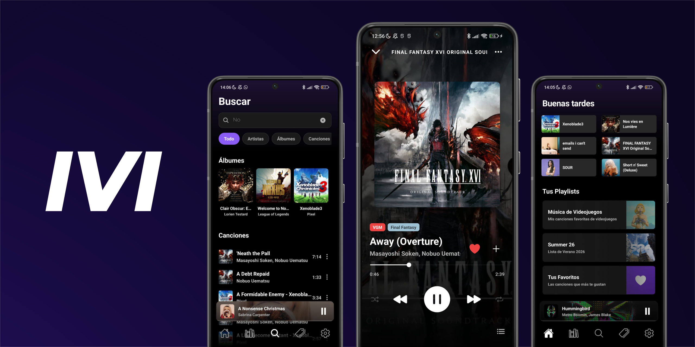

# MMPlayer

A high-performance, offline-first local music player built with React Native.

MMPlayer is designed to handle massive local audio libraries with extreme efficiency. By combining a reactive database architecture with advanced memory management and lazy loading techniques, it delivers a fluid, uncompromised user experience regardless of the library size.



## Key Features

* **High-Performance Audio Engine:** Instant playback initialization for large queues (capable of handling 5,000+ tracks instantly) using chunk-based lazy loading and background indexing.
* **Smart Library Synchronization:** Passive, event-driven file scanning that only triggers during specific application lifecycles (launch, foregrounding, or manual refresh) to eliminate background battery drain.
* **Reactive Data Architecture:** Powered by WatermelonDB, ensuring that the user interface is completely data-driven and updates synchronously with any underlying database changes.
* **Advanced Metadata Management:** Robust extraction of ID3 tags, including complex regex parsing to separate and categorize multiple collaborating artists per track.
* **Cascading Data Integrity:** Automatic purging of orphaned records. When a local file is deleted or a folder is excluded, the system instantly cleans up associated playlists, listening history, and tags, stopping playback gracefully if required.
* **Custom Tagging System:** Organize tracks and albums with user-defined tags, complete with dynamic contrast-adjusted color coding for optimal readability.
* **Comprehensive Library Navigation:** Dedicated views for Albums, Artists, Playlists, Tracks, and Folder structures.
* **Playback History:** Built-in tracking for listening habits and search history.
* **Fluid User Interface:** A meticulously crafted dark-mode interface optimized for 120Hz displays, utilizing `FlashList` for list rendering, hardware-accelerated animations, and dynamic blurred backgrounds based on album artwork.

## Technical Stack

* **Framework:** React Native / Expo
* **Local Database:** WatermelonDB (SQLite Adapter)
* **State Management:** Zustand
* **Audio Engine:** React Native Track Player
* **List Rendering:** Shopify FlashList
* **Animations:** React Native Reanimated & Expo Blur
* **Storage / Persistence:** React Native MMKV & AsyncStorage

## Project Structure Overview

* `src/components/`: Reusable UI components (Bottom Sheets, Cards, Track Rows, Navigation Elements).
* `src/database/`: WatermelonDB setup, schema definitions, migrations, and exact data models (Track, Album, Artist, Playlist, Tags).
* `src/hooks/`: Custom React hooks for search logic, history tracking, and theme management.
* `src/navigation/`: React Navigation stack and tab configurations.
* `src/screens/`: Main application screens (Library, Player, Search, Settings, Detail Views).
* `src/services/`: Core business logic, including the `ScannerService` for local file indexing, `PlaybackService` for background audio events, and `HistoryService`.
* `src/store/`: Zustand stores for global state management (Player State, UI Modals, Sync Status).

## Installation and Setup

### Prerequisites

* Node.js installed.
* Expo CLI installed.
* Android Studio or an Android physical device for testing (Auto-scan features are currently optimized for Android).

### Running the Application

1. Clone the repository:
```bash
git clone https://github.com/yourusername/mmplayer.git
cd mmplayer

```

2. Install dependencies:
```bash
npm install --legacy-peer-deps

```
3. Build and run the project:
```bash
npx expo run:android

```
## License

This project is licensed under the MIT License.

